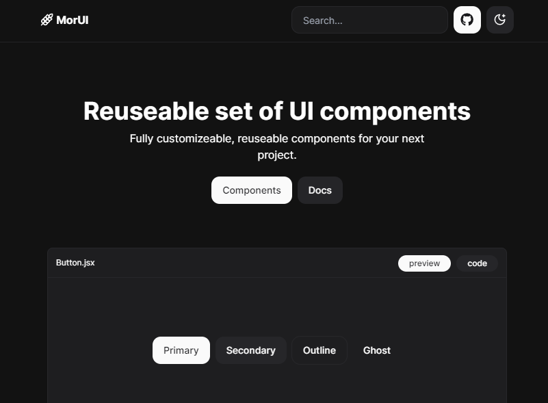
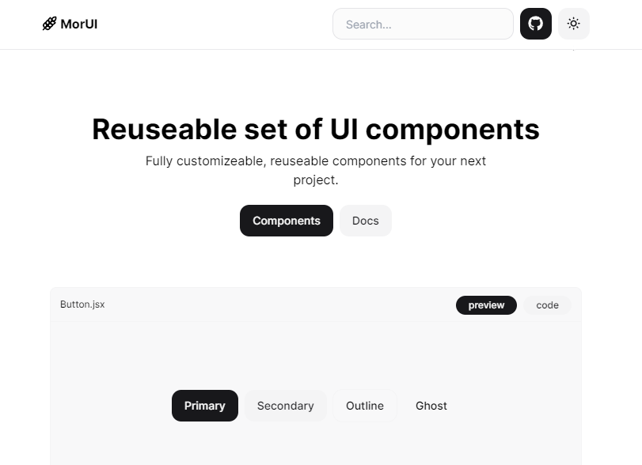

## Mor-Ui

A reuseable components !library built using [React](https://reactjs.org) and [Tailwind CSS](https://tailwindcss.com) with [Next.js](https://nextjs.org) and [Typescript](https://www.typescriptlang.org)

## Preview

 

## Contribution

- Fork it
- Pull request
- Create your feature branch (git checkout -b branch-name)
- Commit your changes (git commit -m "Add some description")
- Push to the branch (git push origin branch-name)
- Open a PR

## License

MIT License
